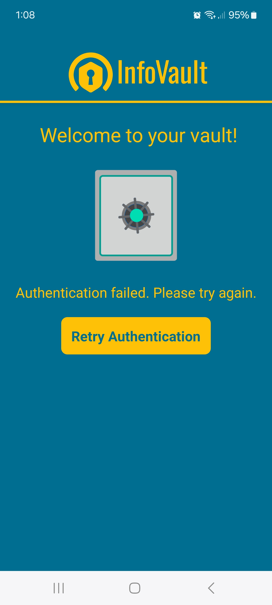
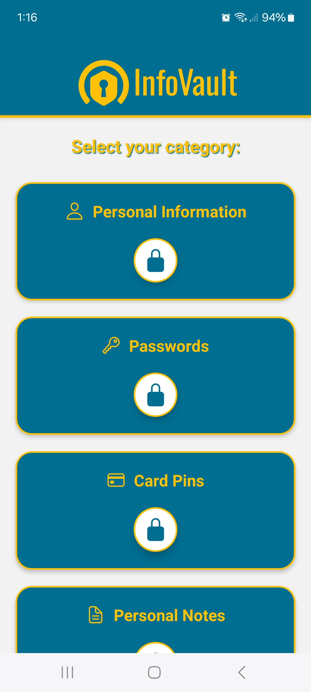
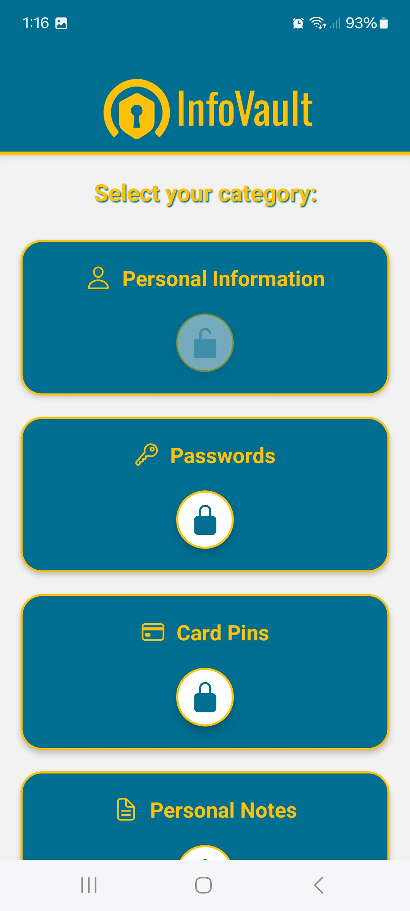
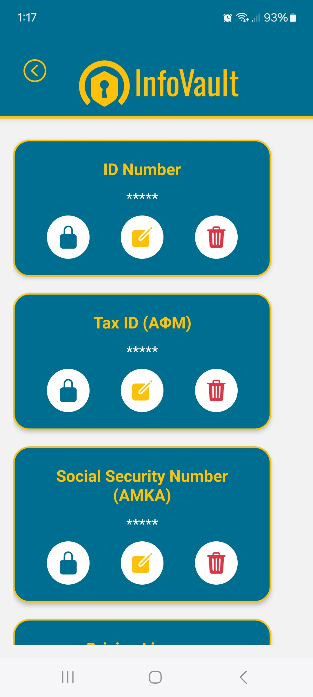
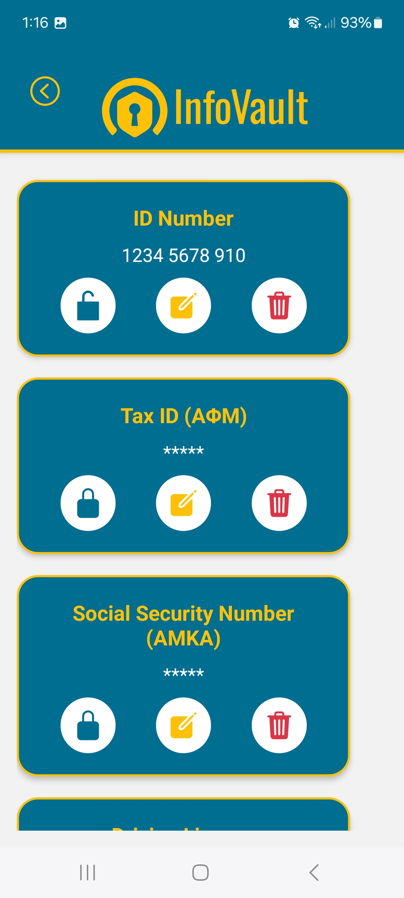
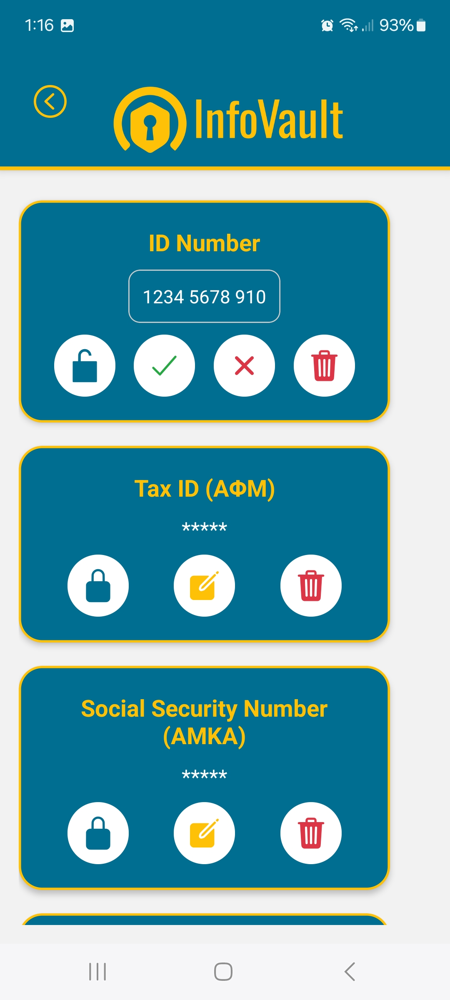

# InfoVault 🔒

InfoVault is a secure and user-friendly personal data manager built with **React Native**. It allows users to store and manage sensitive information like personal IDs, passwords, and notes in an encrypted and organized way.

---

## Features 📋

1. **Secure Storage**:
   - Personal information (e.g., ID numbers, tax numbers) is stored securely using Expo Secure Store.
   - Toggle visibility of sensitive information with encryption.

2. **Categories**:
   - Manage various types of data such as:
     - Personal Information (ID numbers, passport details, etc.)
     - Passwords
     - Personal Notes

3. **Dynamic Cards**:
   - View, edit, and delete information directly from interactive cards.

4. **Local Authentication**:
   - Biometric and PIN authentication for secure access to the app.

5. **User-Friendly Design**:
   - Designed for simplicity and ease of use with pixel-perfect implementation of layouts.

6. **Expandable**:
   - Easily add new categories and features.

7. **Lottie Animations**:
   - Smooth, visually appealing animations for enhanced user experience.   

---

## Usage 🛠️

Personal Information Management

	1.	Navigate to the Personal Info section.
	2.	View your default categories (e.g., ID Number, Passport Number).
	3.	Add new information using the “+” button.
	4.	Edit or delete existing information directly from the cards.

---

## Screen shots 📋

### Auth Screen

### Home Screen

### Personal Info Screen

---

## Technologies Used 🛠️

- **React Native**: Framework for cross-platform development.
- **Expo Secure Store**: For encrypted local storage of sensitive data.
- **Expo Local Authentication**: For biometric and PIN authentication.
- **Lottie**: For smooth and appealing animations.
- **ScaledSheet**: For responsive layout design.

