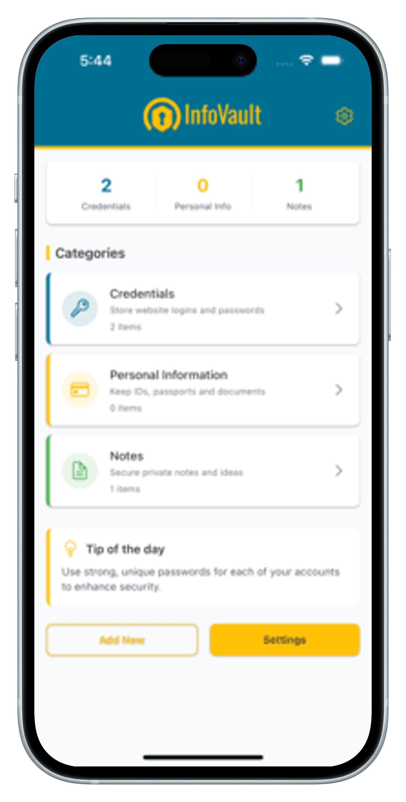

# InfoVault

<div align="center">
  
</div>

InfoVault is a local-first, secure personal information manager built with React Native and Expo. Credentials, identification documents, and private notes are encrypted on the device with a key derived from your master password — data never leaves the phone.

> The full threat model — what InfoVault protects against and what it deliberately does not — lives in [SECURITY.md](SECURITY.md).

## Features

- **Master-password vault** — everything is encrypted client-side; the master password is never stored, and the encryption key exists only in memory while the vault is unlocked
- **Biometric unlock** — optional fingerprint/face unlock, backed by a key held in the platform keystore behind the OS biometric gate
- **Credentials manager** — website logins with a built-in CSPRNG password generator and strength meter
- **Personal information vault** — passports, licenses, IDs, and other documents
- **Secure notes** — categorized private notes
- **Live search** — instant filtering across all three record types

## Security

- **Encryption**: whole-record AES-256-GCM (`@noble/ciphers`); keys derived with PBKDF2-SHA256 (100k iterations)
- **Key handling**: in memory only while unlocked; locking zeroes the key and evicts all decrypted records from state
- **Auto-lock**: idle timeout enforced continuously while the app is open and re-checked when returning from the background
- **Screen privacy**: screenshots/recording blocked while unlocked; an opaque overlay hides content in the OS app switcher
- **Clipboard hygiene**: copied secrets auto-clear after 30 seconds, and immediately on lock
- **Display masking**: sensitive fields are masked by default with an auto-hiding reveal
- **Randomness**: all security-relevant randomness comes from `expo-crypto` (CSPRNG); `Math.random()` is never used

## Getting Started

### Prerequisites

- Node.js 18+
- For device builds: Xcode (iOS) / Android SDK (Android)

### Installation

```bash
git clone https://github.com/terzidest/InfoVault.git
cd InfoVault
npm install
```

### Running

```bash
npm start          # Metro dev server (works with Expo Go for most features)
npm run ios        # build & run the iOS dev app
npm run android    # build & run the Android dev app
```

Native modules (secure storage, biometrics, screen-capture blocking) require a dev build — after changing native dependencies, rebuild with `npm run ios` / `npm run android` rather than only reloading Metro.

### Quality checks

```bash
npm run typecheck  # strict TypeScript, no emit
npm run lint       # ESLint, zero-warning policy
```

Both run in CI on every pull request.

## Project Structure

```
src/
├── assets/          # Images and Lottie animations
├── components/
│   ├── ui/          # Base primitives (Input, Button, Select, ...)
│   ├── layouts/     # Header
│   └── features/    # Domain components + AutoLockGate (lock lifecycle)
├── screens/         # One folder per domain + auth, settings, Home
├── store/           # Zustand stores (auth, settings, 3 domain stores)
├── services/        # Side-effect boundary: SecureStore, biometrics, clipboard
├── navigation/      # Typed native stack
├── theme/           # Color palette (source of truth for JS; mirrored in Tailwind)
├── utils/           # Pure functions: crypto, validation, masking, formatting
├── hooks/           # useAuth
└── types/           # Shared models, navigation, storage types
```

## Technology Stack

- **React Native + Expo** (dev builds; TypeScript strict mode)
- **@noble/ciphers / @noble/hashes** — AES-256-GCM and PBKDF2
- **Expo Secure Store** — platform keystore-backed storage
- **Expo Local Authentication** — biometric gate
- **Zustand** — state management
- **React Navigation** (native stack)
- **NativeWind** — Tailwind-style styling
- **Lottie** — unlock animation

## Roadmap

- Change-master-password flow (with full re-encryption and biometric key rotation)
- Encrypted export/backup
- Argon2id key derivation (documented upgrade path in [SECURITY.md](SECURITY.md))
- Base64 seal encoding for larger note headroom

## Acknowledgments

- Expo team for the React Native toolchain
- Paul Miller for the noble cryptography libraries
- React Navigation, Zustand, and Ionicons
